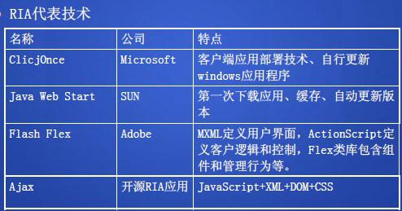

* 范围1-7章
* 题型判断 10；天空20-30；简答20-30；论述10-20；设计10 

###Chapter 1
1. 电子商务系统开发的周期模型与**螺旋模型**相似 
   
2. E-business applications requirements:
 * Improve time to market
 * Access a broader base of customers and suppliers
 * Improve efficiency
 * Reduce costs

3. 电子商务系统是一种Web应用，与其他Web的应用系统相比主要特点是什么(系统层次组成上分析) 

4. E-Commerce与E-Business 的区别
 * E-Commerce (Electronic commerce or EC)
    * The process of buying, selling, or exchanging products, services, or information via computer networks.
 * E-Business (Electronic business)
    * A broader definition of EC that includes not just the buying and selling of goods and services, but also servicing customers, collaborating with business partners, and conductiong electronic transactions within an organization.
5. 信息流、商流、资金流、物流在EB系统中的相互关系
 * 信息流：服务于商流和物流所进行的信息活动的总称
 * 商流：商品在购销之间进行交易和商品所有权转移的运动过程
 * 资金流：资金的转移过程
 * 物流：物质实体(商品or服务)的流动过程
 * 信息流、商流和资金流和通过计算机和网络和网络通信设备实现。**后者比较特殊**，少数可通过网络传输，多数要经过**物理方式传输**。
6. EB系统基本框架中贸易服务的支撑层的内容和作用？([同3](#id13))
7. 完成企业采购招标功能的商务系统可以是 C2B 也可以是 B2B (不考)
8. 简述理想中的E-Business系统具有的功能

******

###Chapter2
1.  HTTP协议的主要特点
 * **无连接**：每次连接只处理一个请求，服务器完成应答后即断开连接，节省传输时间。
 * **无状态**：协议对于事务处理没有记忆能力，虽然导致每次链接传送的数据量增大，但是服务器应答迅速。
 * 支持C/S
 * 简单快速
 * 灵活
2. B/S模式中包含了C/S模式(True)
3. 动态电子商务是动态生成网页(False)
 * 电子商务过程和相关系统可以动态地适应和支持不断变化的商业战略和行为。
4. 每个出现的Web2.0技术都有是Web2.0总体目标的部分体现，举例说明自己最熟悉的Web2.0技术说明其在电子商务方面的应用。
 * 主要技术和产品: Blog、RSS、Wiki、Podcst、Flikr、Tag、Ajax、P2P...
 * Web2.0以人为中心契合了电子商务的发展趋势，可以推进以产品为中心。用户评论、圈内推荐、产品标签、站内搜索和博客等技术成为必然选择。
 * Web2.0与电子商务的结合
    * 产品信息展示手段更新
    * 更好支持博客营销和口碑营销
    * 更好的客户关系和个性化服务
    * 与EB不是简单的功能叠加，而是在长尾理论、六度分割以及去中心化指导下的技术应用，是质的变化。
5. 网络计算的模式：
 * 集中式计算模式、分布式计算模式、Web计算模式
6. Internet、Intranet & Extranet?
 * **Internet**: 是B2C模型的基础，体现随时、随地购物体验
 * **Intranet**: An internal corporate or government network that uses Internet tools, such as Web browsers, and Internet protocols.是B2B的基础，公司和产品的信息中心，公司内部信息交换，用防火墙把费雇员隔离在外面。
 * **Extranet**: A network that uses the Internet to link multiple intranets. 将经销商、承包商、供应商和主要客户联系起来，在更大的社区内开展电子商务的一个共享内联网。 

7. 构成Web的主要因素
 * Web服务器、浏览器、HTTP(HTTPS)应用协议、HTML(XML)数据格式、URL资源标识机制
8. 电子商务系统4个发展阶段的特点：
 * 信息发布阶段(EB雏形)
    * 企业内部全面利用现在信息技术
    * 企业采用B/S、用WWWServer发布信息
    * 网站作为形象宣传和信息发布共组，静态Web，与内部信息系统没有直接联系
 * 事务处理阶段(初级电子商务系统)
    * 允许客户通过Internet直接安全访问电子商务系统完成服务
    * 与企业建立的信息系统的互联问题没有很好解决，不能对企业的整个上午过程提供支持(系统不完整)
    * 动态Web技术、事物Web技术
    * 采用3层结构来处理客户端请求
 * 系统集成阶段(萌芽到发展)
    * 实现了与企业原有系统和合作伙伴系统的集成，着重于B2B
    * EB系统与企业内部信息系统连接成整体
    * 企业加强与合作伙伴和用户的联系，建立**价值网络**
 * 动态电子商务
    * 着重于B2B的下一代EB，下一个发展阶段，扩展Web服务来完成强壮的事务处理和工作流处理，动态地采用电子商务过程和相关系统来支持战略的改变。
    * 利用Web服务，采用相应的工业标准来简化系统和系统间的链接
    * 商业尸体能在其自身的域内以及在贸易合伙人之间有步骤地进行管理和交互、发现新的合伙人级商务实体的集成。
    * 着重**程序对程序**的交互作用，而非早期客户对程序的交互
9. EB网站的个性化目标及实现技术分析
 * 目标：实现用户的个性化定制，采集个人的数据，分析并迎合用户的喜好等
 * 技术：Cookie、URL重写、表单隐藏字段、Session机制、协同过滤软件、兴趣复选框、基于规则的个性化、神经网络
10. 简述Web2.0在电子商务的客户关系管理中可以加强哪些新特性
 * 个性化信息收集、资讯订阅、个人购物门户、客制化购物流程等个性化服务。

******
###Chapter3
1. 针对JSP技术：
 * JSP是包含了JSP标记的HTML/XML文档
 * Server要支持Java
 * 在Server解释执行
 * 在Server时多线程执行(同一个JSP可以在多个线程中运行)
2. JavaScript优势:
 * 无序增加新硬件改善系统性能
 * 降低服务器端的处理负荷
 * 降低网络通信量
 * **不能**提高服务器端处理速度
3. Servlet可以处理的HTTP请求
 * GET、POST、HEAD、OPTIONS、PUT、DELETE和TARCE，常用GET、POST
4. 说明某个基础J2EE的Web应用开发框架特点、优缺点、如何使用等等
 * Struts提供了一些接口，通过调用这些接口来结合servlet+jsp,本题也是开放性的，主要老师想看一下大家之前项目中是怎么做的，也可以用其他框架来说明。
5. 服务器端技术：PHP、ASP、JSP、JavaServlet、EJB、CGI、SSI、ServerAPI
6. 客户端技术： JavaApplets、Multimedia Plugin、JavaScript、HTML/CSS、ActiveX、Frames
7. 在Web设计中，可采用服务器端逻辑体系结构、客户端脚本体系结构以及客户端应用体系结构。简述其应用场景和采用的技术。
 * 服务器端逻辑体系结构：
    * B/S交互动作：浏览器每个动作产生一个对服务器的请求，服务器返回页面进行响应。
    * 客户端初次启动快，对客户端资源要求低
    * 技术：服务器端技术。
 * 客户端脚本体系结构
    * 脚本作为HTML的一部分从Server传到Client，由浏览器解释执行
    * B/S通信量少，服务器端压力小
    * 技术：ECMAScript、JavaScript、Jscript、VBScript 和 DHTML
 * 客户端应用体系结构
    * 提供一个在客户端的功能完整的应用程序。
    * 淡化用户界面和业务逻辑的且别、通信量少、Web页面可离线浏览、所需服务器资源少
    * 技术：JavaApplets、可下载JavaProgram、ActiveX、browser Plugin
8. JSP语句类型
 * Directive 指令语句 <%@ include file="xiaoming.html"%>
 * Scripting Element 脚本元素 `<%! code %> or XML:<jsp:declaration>code</jsp:declaration>`
 * Action 动作语句 <jsp:setProperty ... /> <jsp:useBean .... />
9. J2EE基于组件模型、其客户端不一定是浏览器、可运行在EJB、WEB容器中，采用了Java设计实现应用系统的规范。
10. 设计题不用写代码，用图表示各个模块并说明各个模块的作用和实现，哪些模块体现MVC(登陆模块、个人信息管理、显示等等)
11. 举例说明RIA(Rich Internet Application)对Web应用系统带来的优势和缺点
 * RIA试运行于B/S结构上的C/S应用，具有异步请求、动态加载服务器响应数据、避免频繁刷新页面 

* 以Ajax为例：
 * 优点： 在客户端利用JS处理Server的响应，交换数据大量减少，减少Server负担，不更新页面就可以维护数据，不需要任何浏览器插件但是需要用户允许JS的运行
 * 缺点：
    * 破坏浏览器后退按钮的正常行为（浏览器只记静态页面）
    * 难于保存特定状态的页面到收藏夹
    * 对XMLHttpRequest的不恰当处理会导致网络延迟
    * 一些手持设备还不能很好的支持
    * 兼容性和Debug
    * 无刷新重载
    * 对流媒体的支持没有Flash、JavaApplet好
    
******
###Chapter4
1. 商业模式 ：
 * 自助式模式：用户对商家
 * 协作模式：用户对用户
 * 信息聚集：用户对数据
 * 扩展企业模式：商家到商家(B2B)
2. 应用程序模式的作用：定义实现商业模式、集成模式或者复合模式的高级逻辑组件以及组件间的交互方式
3. 你特长哪些模式的设计，原因
 * 第一级
    * 商业模式
    * 集成模式
    * 复合模式
    * 定制设计
 * 第二级：应用程序模式
 * 第三级：运行时模式
 * 第四级：产品映射
4. 自助式商业模式的作用：解决了一般情况下内部和外部用户与企业事务和数据的交互。
5. 如何理解功能需求决定业务架构，非功能需求决定技术架构？
 * 非功能需求定义了系统性能、效率上的一些约束、规则。而系统的技术构架要能够满足这些约束和规则。例如可扩展性可通过添加更多服务器增强可扩展性，等等
6. 电子商务系统的非功能需求主要在哪一级模式中体现？为什么？
 * 主要在运行模式上体现，比如可用性、安全性只有在运行时才能表现出来

******
###Chapter5
1. 电子商务安全需求方面
 * 机密性(Confidentiality)：预防非法信息存取和信息在传输过程中被非法窃取(信息加密)
 * 完整性(Integrity)：预防对信息随意生成、修改和删除，防止数据传输过程中信息的丢失和重复并保证次序统一(提取信息摘要技术)
 * 认证性(Authenticity):为参与交易的个人、企业或者国家提供可靠的标识，防止欺诈(证书机构CA和证书)
 * 不可抵赖性(Non-repudiation)：对交易尸体的身份进行鉴别，为身份真实性提供保证，双方不见面也能确认身份(数字签名)
 * 有效性(可用性)：对各种故障、错误加以控制和预防，保证贸易数据在确定的时刻、确定的地点是有效的。
2. 单钥和双钥在实现商务系统机密性时各自的特点。 

3. 只有在双钥体制中才能进行数字签名么？为什么？
 * 一般是用双钥，但是不一定
4. 如何鉴别数字证书的真伪？得到了服务器的证书是否可以确定该服务器可信？
 * 通过数字签名鉴别数字证书真伪
 * 得到了服务器证书先判别真伪，若为真，再采用认证技术判断该证书是否属于该服务器
 > PS:
 > 信息来源：数字签名+认证
 > 完整性：消息摘要+签名
 > 正确顺序：时间戳+作业流水号
5. CA是为客户发放和管理数字证书的机构，其本身是否也需要数字证书？(要)
6. 设计一个安全方案，满足用户A和B之间的通信的不可否认性
 * 注意是A和B之间通信的不可否认性而不是发送方，这边要确认双方的不可否认性，可以采取第三方机制来记录收发的内容，也可以采用一个平台来统一管理
7. 使用数字签名验证数据完整性的步骤 

8. SSL如何保证浏览器和服务器之间传递的请求和相应信息的保密性。
* 保密性：握手之后，采用单钥体制进行数据加密、采用双钥体制进行身份鉴别。
> PS
> 完整性：采用消息摘要算法进行完整性检查
> 认证服务：虽然客户端认证可选，但是服务器端实证被认证
> 灵活性：双方可选择加密算法，允许多种形式各种级别的身份鉴别

******
###Chapter6
1. 通过第三方代理人的信用卡支付方式是如何保证支付安全的？
 * 用户账户开设不通过网络
 * 信用卡信息不在开放网上传送
 * 通过电子邮件来确认身份
 * 商家自由度大风险小
 * 由可信第三方(经纪人)完成
2. 安全电子交换协议SET是否能保证信息传输的机密性、真实性、完整性和不可否认性？保证真实性的主要手段是什么？
 * 机密性：数字信封(对称密钥加密数据)
 * 不可否认：使用RSA算法
 * 完整性：通过SHA-1生成信息摘要
 * 真实性：双重签名
3. 双重签名的作用是什么？
 * 作用：对订单信息和支付信息分别进行签名，然后发给商家，商家只能解密订单信息，但是能验证订单信息与支付信息相匹配，再发给银行或者第三方，etc（再加点保护了XXX的XX性之类的）
4. Merchant originated payment(MOP)支付方式与SET的主要区别是什么？
 * MOP：
    * **不要客户钱包软件**
    * **不用客户提供数字证书**
    * 使用密钥加解密
    * 从商家开始的支付流用SET
    * **不能证明消费者真实性**
    * 手动输入卡号
    * **卡不在场**的交易
5. 电子货币的技术特征有哪些？
 * 电子化方法+安全对策
    * 电子化方法进行发行、流通、回收
    * 密码技术防止伪造、复制和非正当使用
> PS:
> 结算特征：预付型、即付型、后付型
> 流通特征：闭环型(一次转手)、开环型(多次辗转)
6. 数字信封的作用是什么？
 * 封装会话密钥，使得在一次会话中，对称密钥能够安全的传递。以便于在接下来的交流中使用对称密钥进行加密传送。

******
###Chapter7
1. XML如何把文档的数据处理、结构定义以及显示方式三要素独立开来？
 * XML的数据处理依赖于解析器和2个应用程序（SAX和DOM）
 * 结构定义依赖于DTD和Schema
 * 显示方式依赖于CSS，XSL和层叠样式表
2. 2种解析XML文档的方式各自的特点是什么？
 * SAX：流形式读XML文档、基于事件通告方式、适合查找大文档、事实上的标准
 * DOM：全部文档装入内存、属性文档对象、方便处理小文档内容
3. CSS和XSL的区别是什么？
 * CSS是为HTML设计的，只有显示功能
 * XSL是专门为XML设计的，不仅仅有显示功能，还包括数据的匹配和提取功能

