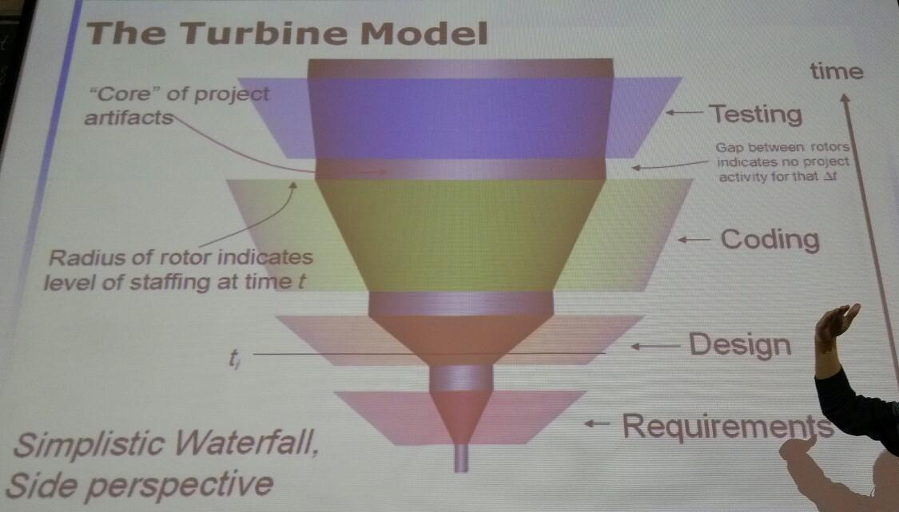
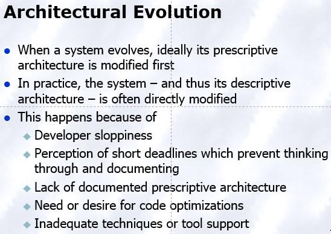
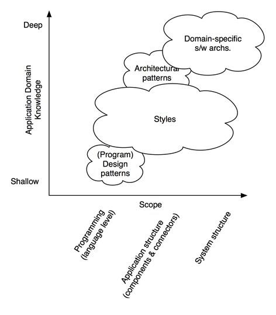
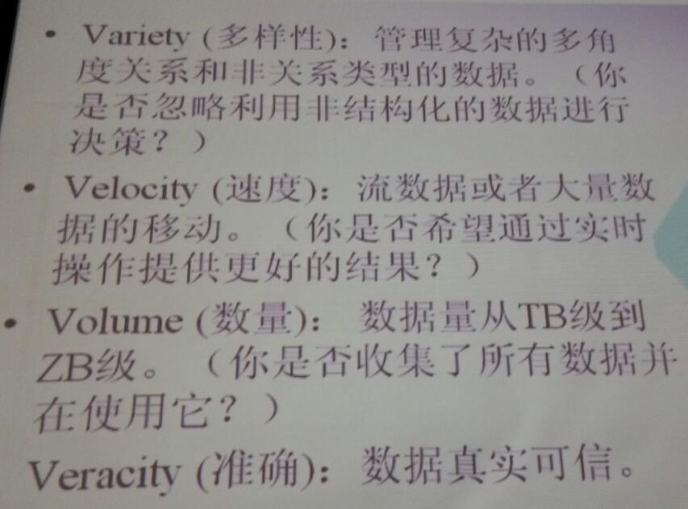

##Basical Info
* 吴晓军
* ace.wlan@gmail.com

******
###Book
* Software Architecture in Practice (3rd edition)

Len Bass, Paul Clements, Rick Kazman

 (SEI Series in software engineering)

* Documenting Software Architectures Views And Beyond

******
###Exams
* 笔试
* 考勤，课内测验
* 纯简答 英文 开卷
* 简答6*10
* 问答10*4(多一些)
* 题目都有铺垫
* 周三晚上3301 19:00~21:30 题量大

******
* Modeling down free or open-source tools
* **Connectors**

******
###Public Email
* ugrad_sa@sina.com

pwd:2014Spring
***
##NOTE
*  软件**工程**三维空间观
 * 过程 方法 工具
* Architecture in action: Desktop, Product Line(非生产线)的实现:Reus
* Software is complex:
 * Complexity
 * Conformity
 * Changeability
 * Intangibility
* Analogy: Architecture of buildings but has limitations

####Summary1
* Software is complex
* So are buildings
* Learn from other domains
* Need and have developmented

##Processing- Architecture-centric

------
* Architecture: a set of prinpal design decisions about a software system.
* Fundamental Understanding:
 * Each app has an architecture
 * Each app has at least one architect
 * Architecture is not a phase of development
* **Requirements Analysis**: New product comes from the observation of existing object.
* **Design&Architecture**: design can just creates part of architrcture
 * **structure**: component & interconnection
 * **archichecture**: more than structure; including action, connection etc.
* Traditional design VS ar-itecture-centric design
 * Tra.. suggests translating requirements into algorithms.
 * arch.. in charge of many things:
   * stakeholder issues
   * use of component
   * overarching style&structure
   * class structure
   * deployment
   * post implementation
 * Tools: OOD(面向对象设计) & DSSA(Domain Specific Software Architecture) 高度复用 eg: product line
* **Implementation**: Code should be faithful to the architecture
 * Strategies
   * writing all code manually
   * Reuse-techniues
   * Middleware
   * Framework
   * Generative techniques
* **Architecture & Testing**
 * undertaken to assess **artifact**(包括编码前的体系结构等人工制品)
 * High format: can use many automatical tools
* **Evolution & Maintenance**
 * traditional approach is ad hoc
 * architecture-centric:
   * Motivation
   * Evalution
   * Design; Choose approach
   * Action
* **Process**
 * Process is focal -> Product(Artifact) is focal
 * No single "right" process for architecture-centric engineering
 * Visualization: Turbine Model 
  

####Summary
* A proper view of software architecture affects every aspect of the classical software engineering activities
* The requirements activity is a co-equal partner with design activities
* The design activity is enriched by techniques that exploit knowledge gained in previous product developments
* The implementation activity
 * is centered on creating a faithful implementation of the architecture
 * utilizes a variety of techniques to achieve this in a cost-effective manner
* Analysis and testing activities can be focused on and guided by the architecture
* Evolution activities revolve around the product’s architecture.
* An equal focus on process and product results from a proper understanding of the role of software architecture

##Basic Concepts

------
* **Defination**
 * The set of  principal design decisions about the system.
   * Structure
   * Behavior
   * Interaction
   * Non-functional properties
* **Temporal Aspect**
 * At any given point in time the system has only one architecture; 
* **Prescriptive vs Descriptive**
 * Architecture Evolution 

* **Architectural Degradation**
 * Architecture drift
   * Do not violate any of the prescriptive architecture's design decisions.
 * Architecture erosion
* **Architectual Recovery**
 * Defination: Determine a software system's architecture from its implementation-level artifacts
   * Source Code
   * Executable Files
   * Java- class files etc
 * **Clustering(聚类)** 
 * Syntacric Clustering
 * Semantic Clustering
* **Deployment**
 * Defination: Executable modules are physically placed on the hardware devices on which they are supposed to run
 * Critical in assessing whether the system will be able to satisfy its requirements
   * From Available memory、Power Consumption、Required Network Bandwith etc

###Elements
* **Components**: Elements that encapsulate processing and data in a system's architecture
 * Encapsulates a subset of the system’s functionality and/or data
 * Restricts access to that subset via an explicitly defined interface
 * Has explicitly defined dependencies on its required execution context
 * Provide Application-specific services
* **Connector**: An architectural building block tasked with effecting and regulating interactions among components.**(Difference with components)**
* **Configuration/topology**: A set of specific associations between the components and connectors of a system's architecture.
* **Architectural Style**: Named collections of architectural design decisions.
 * Are applicable in a given development context
 * Constrain architectural design decisions that are specific to a particular system within that context
 * Elicit beneficial qualities in each resulting system
* **Architectural Patterns**
 * Defination: A set of architectural design decisions that are applicable to a **recurring design problem**, and parameterized to **account for different software development contexts **in which that problem appears
   * Eg. Three-tiered System Pattern
* **Models, Views and Visualizations**
 * Models: An artifact documenting some or all of the architectural design decisions about a system
 * View: A subset of related architectural design decisions
* **Architectural Processes**
 * Architectural Design 
 * Architectural Modeling & Visualization
 * Architecture-driven system analysis
 * Architecture-driven system implementation
 * Architecture-driven system deployment, runtime redeployment, and mobility
 * Architecture-based design for non-functional properties, including security and trust
 * Architectural adaptation

##Desiging
------
* Objective: Creativity & Method (When to use which)
* Process
 * Feasibility stage: Identifying a set of feasible concepts for the design as a whole
 * Preliminary design stage: Selection and development of the best concept.
 * Detailed design stage: Development of engineering descriptions of the concept
 * Planning stage: Evaluating and altering the concept to suit the requirements of production, distribution, consumption and product retirement
* Strategies to Potential Problems(Less Experience, Increasing complex, Standard approach not suitable)
 * Standard
 * Cyclic( Revert to an earlier stage)
 * Parallel (Independent alternatives are explored in parallel)
 * Adaptive (The next design strategy of the design activity is decided at the end of a given stage)
 * Incremental (Each stage of development is treated as a task of incrementally improving the existing design)
* Tools
 * Abstraction: Choose the terms of discourse
 * Separation of concerns
 * Refined Experience
* **Patterns, Styles DSSAs**

##Architecture Style
------
###Main Program and Subroutines LL

##Connector 
------
* 连接器，张力分散 平衡

##Choose Connector
------
* REST representational state transfer
 * 呈现和状态信息相结合在互联网中传递，信息自包含。
* SOAP Simple 

* 分布式 分散式
Globusl
分散式 fabric 建立资源池 不考虑上层，resources 单一资源如何满足多个请求， 
ITaas

##云计算:
####部署类型: 
* 私有云
* 公有云
* 行业云
* 混合云
####应用层次
* IaaS 基础设施即服务
* PaaS平台..
* SaaS Software as a service

##Big Data
####认识
* 对不同应用 大的程度不一样
* 释义
 * **Variety Velocity Volume**....

* **Value 终极目标**

####体系结构
* 传统计算
 * 对历史事实查找，对IO进行读写，批处理，拉动模型(主动请求数据)，查询驱动
* 流计算
 * 对当面正在发生的数据进行分析，目前事实查询，数据驱动，推动模型

####关键技术-Hadoop
* 由许多开源子项目组成，生态系统(互通 互操作)
* 分布式 存储 处理 数据库 数据分析挖掘
* Hive ETL(清洗，转换，装载load)
####应用场景
* 大数据探索
* 360度用户分析
* 运营分析
* 安全和智能扩展
最佳实践
